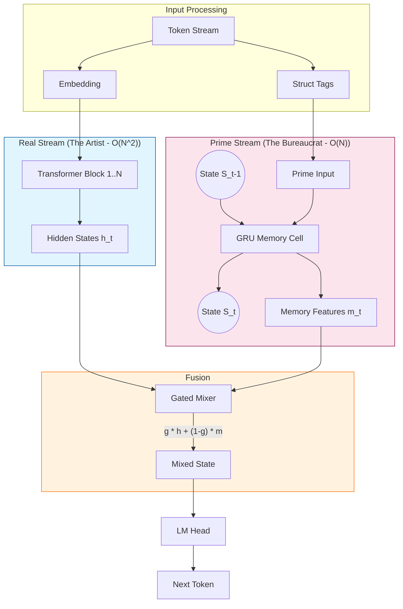

# Project Panini-Meru (PMeru)

A 6GB-VRAM friendly hybrid language model for **valid syntax + strict workflows**.

**Panini-Meru** combines:

- a **Real Stream** (quantized Transformer) for natural language fluency, and
- a **Prime Stream** (recurrent “syntax/state engine”) for long-horizon structure and rule enforcement,

so the model stays coherent and compliant without needing massive long-context attention.

This repo is designed for **training on a laptop GPU (~6GB VRAM)** using QLoRA + gradient checkpointing.

---

## v1.1 Release Features

- **Deep Fusion**: Prime Stream observes Layer 12 (middle) of the base model, preventing "Lazy Bureaucrat".
- **Auxiliary Loss**: Forces the specialized memory to predict structure, ensuring it aids generation.
- **KV-Cache Support**: Full support for `past_key_values` for faster inference.
- **Composite Tags**: Event model tracks both Risk and Action types simultaneously.

---

## The Core Problem: Validity vs. Fluency

Standard LLMs (Real Stream) are probabilistic: they write "what sounds good."  
They often fail at **Strict Adherence** (e.g., adhering to a schema, a specific indentation rule, or a long-distance variable definition) because attention is expensive ($O(N^2)$) and decays over long contexts.

## The Adelic Solution (Panini-Meru)

We physically fuse two distinct "brains" together:

1.  **The Eloquent Artist (Real Stream - Transformer)**:
    - **Role**: Handles natural language, creativity, and local syntax.
    - **State**: Stateless $N \times N$ attention.
    - **Cost**: Expensive. Good at _short-term_ fluency.

2.  **The Strict Bureaucrat (Prime Stream - GRU/RNN)**:
    - **Role**: Tracks **State** and **Structure**. It remembers "I am inside Class X, Function Y, Indent Level 2".
    - **State**: Recurrent ($h_t = f(h_{t-1}, x_t)$).
    - **Cost**: Cheap ($O(N)$). infinite "depth" memory but low "resolution".

### Theoretical Benefits (Why we do this)

1.  **Infinite Context for Rules ($O(N)$ cost)**:
    - Standard LLM: To remember a variable defined 10,000 tokens ago, it must attend to it every single step ($N^2$).
    - PMeru: The "Prime Stream" carries that variable's existence in its hidden state $h_t$ for free. The computational cost is flat, regardless of sequence length.

2.  **Constraint Adherence (The "Panini" Effect)**:
    - By feeding "Structural Tags" (indentation, scope) explicitly into the Prime Stream, we force the model to be aware of the _valid_ syntax tree at all times.
    - The **Gate** mechanism allows the "Bureaucrat" to override the "Artist" when a rule is about to be broken (e.g., closing a parenthesis that wasn't opened).

### 3. Low-VRAM Efficiency

    - We get the behavior of a massive long-context model while running on a **6GB Laptop GPU**, because we don't need a massive KV cache for the structural long-range dependencies.

## Concrete Example: "The Lost Indentation"

Imagine generating a Python function that is 5,000 tokens long (longer than the context window of a small model).

**Scenario**: We are deep inside a nested loop in `process_data()`.

**Input Context**:

```python
def process_data(items):
    if validation_passed:
        for item in items:
            try:
                # ... [4000 tokens of complex logic] ...
                # The model has lost the start of the function from its window.
```

#### Without Panini-Meru (Standard LLM)

The model forgets it is inside a `try/except` block because the `try:` keyword token fell out of the context window.
**Output (Failure)**:

```python
    return result  # ❌ ERROR: SyntaxError. Dedented too early.
                   # It forgot it needs an 'except' block or to stay indented.
```

#### With Panini-Meru (Adelic)

The **Prime Stream** (GRU) has maintained a state vector that encodes: `depth=4`, `scope=try_block`. This vector persists even if the token history is gone.
Input to Transformer: `[Token Embeddings]` + `[Prime Memory: "EXPECT_EXCEPT_BLOCK"]`
**Output (Success)**:

```python
            except ValueError:  # ✅ SUCCESS: The 'Bureaucrat' forced the 'Artist'
                log_error()     # to close the block correctly.
```

---

## Hardware target

- GPU: **6GB VRAM**
- RAM: **16GB+** recommended
- Disk: 30–80GB depending on datasets and caching

---

## Repository Structure

```
panini-meru/
├── configs/                    # Hyperparameter configurations
│   └── production_v1.yaml
├── src/
│   └── pmeru/
│       ├── model/
│       │   ├── prime_memory.py # GRU-based Recurrent Memory (The "Bureaucrat")
│       │   ├── mixer.py        # Gated Residual Mixer (The "Gate")
│       │   └── wrapper.py      # HuggingFace Model Wrapper
│       ├── data/
│       │   ├── text_stream.py  # Streaming Dataset Loader
│       │   └── struct_tags.py  # Structural Tag extraction
│       └── train/
│           └── train_text.py   # Main QLoRA Training Loop
├── scripts/                    # Utilities and Benchmarks
│   ├── run_benchmark.py
│   ├── check_status.py
│   └── generate_demo.py
└── output/                     # Model artifacts (Ignored by Git)
```

## Architecture Diagram (Adelic Dual-Stream)



---

## Install

### 1) Create env

```bash
python -m venv .venv
source .venv/bin/activate     # Linux/macOS
# .\.venv\Scripts\activate    # Windows PowerShell
```

Note in current machine use ml env of conda

### 2) Training

#### Quick Test (verify setup)

Runs a minimal loop to check for crashes (NaNs, OOMs).

```bash
python -m src.pmeru.train.train_text \
  --run_name test_run \
  --steps 10 \
  --seq_len 128 \
  --gradient_accumulation_steps 4
```

#### Production Training (Real)

Trains for ~1 epoch with full context. Expected time: **4-8 hours** on a GTX 1660/RTX 3060.

```bash
python -m src.pmeru.train.train_text \
  --run_name production_v1 \
  --steps 2000 \
  --seq_len 2048 \
  --prime_dim 128 \
  --checkpoint_every 200 \
  --gradient_accumulation_steps 16 \
  --injection_layer 12 \
  --aux_loss_weight 0.5
```

### 3) Monitoring

Open `notebooks/analysis.ipynb` in VS Code to see live loss charts.

---

## 🛠️ Advanced Usage

### Inference: Managing State Across Chunks

The **Adelic** architecture is stateful. Unlike a standard Transformer where you just pass `input_ids`, here you must manage the **Prime State**.

When generating long code (chunk by chunk):

1. **Initial Step**: Pass `prime_state=None`. The model initializes a zero state.
2. **Next Steps**: The model returns `new_prime_state`. You **must** feed this back into the next forward pass.

```python
# Pseudo-code for stateful generation
prime_state = None
generated_text = ""

for chunk in infinite_stream:
    # 1. Calculate structural tags for the chunk
    tags = tagger.get_tags(chunk)

    # 2. Forward pass
    output = model(input_ids=chunk, struct_tags=tags, prime_state=prime_state)

    # 3. Carry state forward - This is the O(N) memory magic!
    prime_state = output['prime_state']
```

### Implementing Custom Data Loaders

We use a streaming dataset architecture. To use your own data:

1. Modify `src/pmeru/data/text_stream.py`.
2. Ensure your dataset yields a `text` field (or `content`/`code`).
3. The `TextStreamDataset` class automatically handles:
   - Tokenization
   - Structural Tagging (via `StructTagger`)
   - Alignment of tags to tokens

If you want to use **advanced tags** (e.g., TreeSitter parse depth), modifying `src/pmeru/data/struct_tags.py` is the only place you need to touch. The model is agnostic to _what_ the tags mean, as long as they are integers `< num_struct_tags`.
