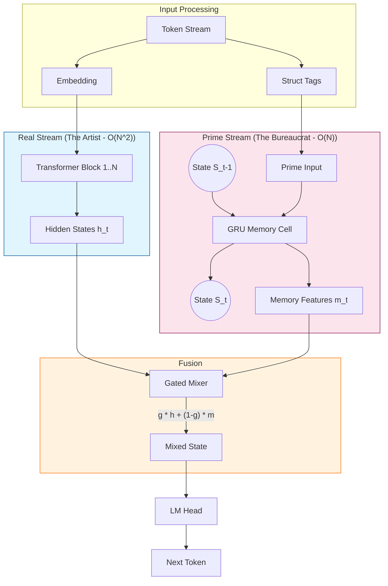

# Project Panini-Meru (PMeru)

A 6GB-VRAM friendly hybrid language model for **valid syntax + strict workflows**.

**Panini-Meru** combines:

- a **Real Stream** (quantized Transformer) for natural language fluency, and
- a **Prime Stream** (recurrent “syntax/state engine”) for long-horizon structure and rule enforcement,

so the model stays coherent and compliant without needing massive long-context attention.

This repo is designed for **training on a laptop GPU (~6GB VRAM)** using QLoRA + gradient checkpointing.

---

## The Core Problem: Validity vs. Fluency

Standard LLMs (Real Stream) are probabilistic: they write "what sounds good."  
They often fail at **Strict Adherence** (e.g., adhering to a schema, a specific indentation rule, or a long-distance variable definition) because attention is expensive ($O(N^2)$) and decays over long contexts.

## The Adelic Solution (Panini-Meru)

We physically fuse two distinct "brains" together:

1.  **The Eloquent Artist (Real Stream - Transformer)**:
    - **Role**: Handles natural language, creativity, and local syntax.
    - **State**: Stateless $N \times N$ attention.
    - **Cost**: Expensive. Good at _short-term_ fluency.

2.  **The Strict Bureaucrat (Prime Stream - GRU/RNN)**:
    - **Role**: Tracks **State** and **Structure**. It remembers "I am inside Class X, Function Y, Indent Level 2".
    - **State**: Recurrent ($h_t = f(h_{t-1}, x_t)$).
    - **Cost**: Cheap ($O(N)$). infinite "depth" memory but low "resolution".

### Theoretical Benefits (Why we do this)

1.  **Infinite Context for Rules ($O(N)$ cost)**:
    - Standard LLM: To remember a variable defined 10,000 tokens ago, it must attend to it every single step ($N^2$).
    - PMeru: The "Prime Stream" carries that variable's existence in its hidden state $h_t$ for free. The computational cost is flat, regardless of sequence length.

2.  **Constraint Adherence (The "Panini" Effect)**:
    - By feeding "Structural Tags" (indentation, scope) explicitly into the Prime Stream, we force the model to be aware of the _valid_ syntax tree at all times.
    - The **Gate** mechanism allows the "Bureaucrat" to override the "Artist" when a rule is about to be broken (e.g., closing a parenthesis that wasn't opened).

3.  **Low-VRAM Efficiency**:
    - We get the behavior of a massive long-context model while running on a **6GB Laptop GPU**, because we don't need a massive KV cache for the structural long-range dependencies.

## Hardware target

- GPU: **6GB VRAM**
- RAM: **16GB+** recommended
- Disk: 30–80GB depending on datasets and caching

---

## Repository Structure

```
panini-meru/
├── configs/                    # Hyperparameter configurations
│   └── production_v1.yaml
├── src/
│   └── pmeru/
│       ├── model/
│       │   ├── prime_memory.py # GRU-based Recurrent Memory (The "Bureaucrat")
│       │   ├── mixer.py        # Gated Residual Mixer (The "Gate")
│       │   └── wrapper.py      # HuggingFace Model Wrapper
│       ├── data/
│       │   ├── text_stream.py  # Streaming Dataset Loader
│       │   └── struct_tags.py  # Structural Tag extraction
│       └── train/
│           └── train_text.py   # Main QLoRA Training Loop
├── scripts/                    # Utilities and Benchmarks
│   ├── run_benchmark.py
│   ├── check_status.py
│   └── generate_demo.py
└── output/                     # Model artifacts (Ignored by Git)
```

## Architecture Diagram (Adelic Dual-Stream)



---

## Install

### 1) Create env

```bash
python -m venv .venv
source .venv/bin/activate     # Linux/macOS
# .\.venv\Scripts\activate    # Windows PowerShell
```

Note in current machine use ml env of conda

### 2) Training

#### Quick Test (verify setup)

Runs a minimal loop to check for crashes (NaNs, OOMs).

```bash
python -m src.pmeru.train.train_text \
  --run_name test_run \
  --steps 10 \
  --seq_len 128 \
  --gradient_accumulation_steps 4
```

#### Production Training (Real)

Trains for ~1 epoch with full context. Expected time: **4-8 hours** on a GTX 1660/RTX 3060.

```bash
python -m src.pmeru.train.train_text \
  --run_name production_v1 \
  --steps 2000 \
  --seq_len 2048 \
  --prime_dim 256 \
  --checkpoint_every 200 \
  --gradient_accumulation_steps 16
```

### 3) Monitoring

Open `notebooks/analysis.ipynb` in VS Code to see live loss charts.
